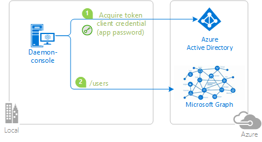
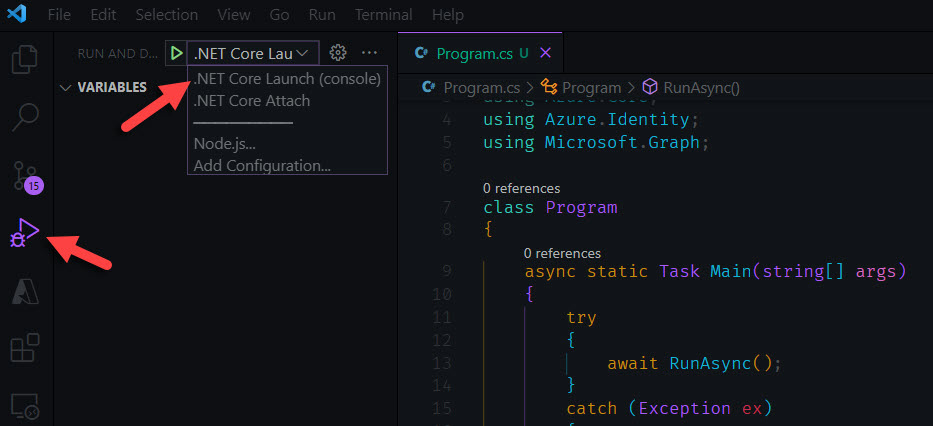
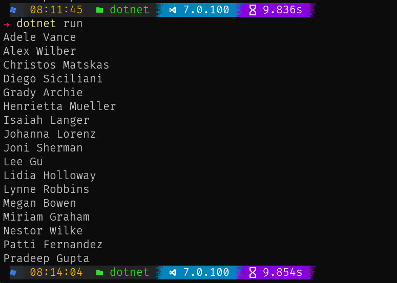
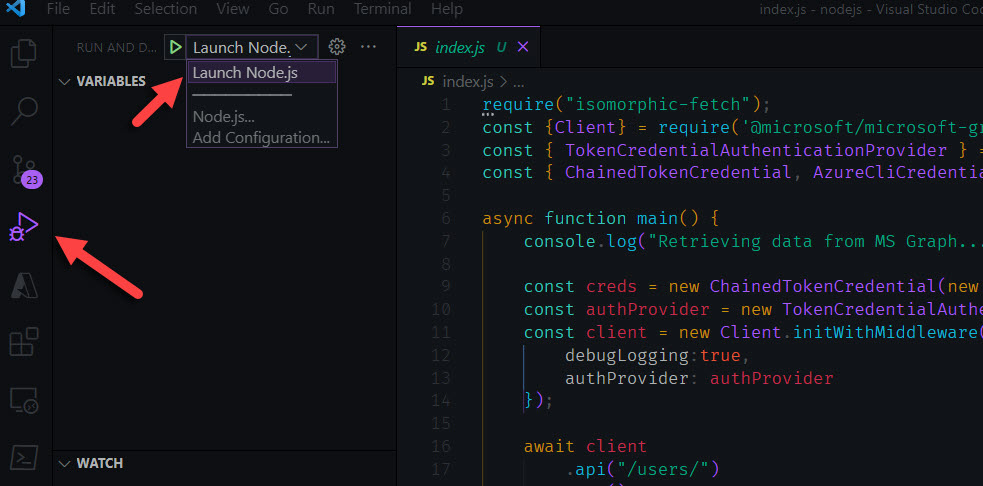
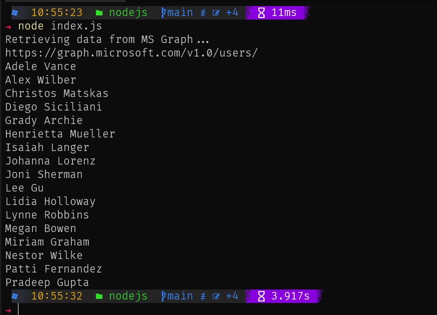

# Workload Identity Workshop
In this workshop you'll learn how to enable Workload Identity features for your solution. The workshop consistes of 2 parts

1. In the first part we will build a simple daemon solution that authenticates with a Service Principal locally and retrieves data from MS Graph
2. Apply Workload Identity capabilities to further secure your solution

## Prerequisites

To go this workshop, you'll need:

- An Internet connection
- [VS Code](https://code.visualstudio.com/Download)
- The workload/framework of your choice
    - For the .NET path, download the [.NET Core 6.0 SDK](https://www.microsoft.com/net/learn/get-started)
    - For the Node.js path, download [Node.js](https://nodejs.org/en/download/)
- [Azure CLI](https://docs.microsoft.com/en-us/cli/azure/install-azure-cli)
- A Windows machine (necessary if you want to run the app on Windows)
- An OS X machine (necessary if you want to run the app on Mac)
- A Linux machine (necessary if you want to run the app on Linux)
- An Azure Active Directory (Azure AD) tenant. For more information on how to get a FREE (no Credit Card required) Azure AD tenant with a P2 license, see [the Microsoft 365 Developer Program](https://425.show/devprog)
- An admin account in your Azure AD tenant. This sample will not work with a Microsoft account (formerly Windows Live account). Therefore, if you signed in to the [Azure portal](https://portal.azure.com) with a Microsoft account and have never created a user account in your directory before, you need to do that now.

## Scenario

The console application:

- gets a token from Azure AD in its own name (without a user)
- and then calls the Microsoft Graph /users endpoint to get the list of user, which it then displays



For more information on the concepts used in this sample, be sure to read the [Microsoft identity platform endpoint client credentials protocol documentation](https://azure.microsoft.com/documentation/articles/active-directory-v2-protocols-oauth-client-creds).

- Developers who wish to gain good familiarity of programming for Microsoft Graph are advised to go through the [An introduction to Microsoft Graph for developers](https://www.youtube.com/watch?v=EBbnpFdB92A) recorded session. 

> ### Daemon applications can use two forms of secrets to authenticate themselves with Azure AD:
>
> - **application secrets** (also named application password).
> - **certificates**.
>
> The first form (application secret) is treated in the next paragraphs.

---------------------------------------

## Getting started

### Step 1:  Clone or download this repository

From your shell or command line:

```Shell
git clone https://github.com/Azure-Samples/active-directory-dotnetcore-daemon-v2.git
```

> Given that the name of the sample is pretty long, and so are the name of the referenced NuGet packages, you might want to clone it in a folder close to the root of your hard drive, to avoid file size limitations on Windows.

### Step 2:  Register the sample with your Azure Active Directory tenant

There is one project in this sample. To register it, you can:

- either follow the steps [Step 2: Register the sample with your Azure Active Directory tenant](#step-2-register-the-sample-with-your-azure-active-directory-tenant) and [Step 3:  Configure the sample to use your Azure AD tenant](#choose-the-azure-ad-tenant-where-you-want-to-create-your-applications)
- or the Azure CLI

#### Create a new Service Principal and assign the right permissions
```
az ad app create --display-name workloadIdentityDotnetDemo
az ad sp create --id <app id from previous command output>
az ad sp credential reset --name workloadIdentityDotnetDemo
```

#### Choose the Azure AD tenant where you want to create your applications

As a first step you'll need to:

1. Sign in to the [Azure portal](https://portal.azure.com) using either a work or school account or a personal Microsoft account.
1. If your account is present in more than one Azure AD tenant, select `Directory + Subscription` at the top right corner in the menu on top of the page, and switch your portal session to the desired Azure AD tenant.
1. In the left-hand navigation pane, select the **Azure Active Directory** service, and then select **App registrations**.

#### Register the client app (daemon-console)

1. Navigate to the Microsoft identity platform for developers [App registrations](https://go.microsoft.com/fwlink/?linkid=2083908) page.
1. Select **New registration**.
   - In the **Name** section, enter a meaningful application name that will be displayed to users of the app, for example `daemon-console`.
   - In the **Supported account types** section, select **Accounts in this organizational directory only ({tenant name})**.
   - Select **Register** to create the application.
1. On the app **Overview** page, find the **Application (client) ID** value and record it for later. You'll need it to configure the Visual Studio configuration file for this project.
1. From the **Certificates & secrets** page, in the **Client secrets** section, choose **New client secret**:

   - Type a key description (for instance `app secret`),
   - Select a key duration of either **In 1 year**, **In 2 years**, or **Never Expires**.
   - When you press the **Add** button, the key value will be displayed, copy, and save the value in a safe location.
   - You'll need this key later to configure the project in Visual Studio. This key value will not be displayed again, nor retrievable by any other means,
     so record it as soon as it is visible from the Azure portal.

#### Add the necessary MS Graph Permissions
1. Navigate to the Microsoft identity platform for developers portal.
1. Select **App registrations**.
1. In the list of pages for the app, select **API permissions**
   - Click the **Add a permission** button and then,
   - Ensure that the **Microsoft APIs** tab is selected
   - In the *Commonly used Microsoft APIs* section, click on **Microsoft Graph**
   - In the **Application permissions** section, ensure that the right permissions are checked: **User.Read.All**
   - Select the **Add permissions** button

1. At this stage permissions are assigned correctly but the client app does not allow interaction. 
   Therefore no consent can be presented via a UI and accepted to use the service app. 
   Click the **Grant/revoke admin consent for {tenant}** button, and then select **Yes** when you are asked if you want to grant consent for the
   requested permissions for all account in the tenant. 

> You need to be an Azure AD tenant admin to do this. If you're using the Azure AD Developer tenant, then you should be OK


#### Sign in the Azure CLI with the Service Principal
```
az login --service-principal -u <SP Id> -p <SP Password> --tenant <Tenant Id> --allow-no-subscriptions
```

---------------------------------------

## Build and Run the Code

### Working with the .NET Core project
Build and open the .NET project in VS Code. In your terminal, type the following:

```
cd src/dotnet
dotnet restore
dotnet build
code .
```
To run the application, you can:
- either use the `dotnet` command line tool
- or use the debugger in the VS Code terminal.

### Using the terminal
In the terminal, type `dotnet run` to start the application.

### Using the debugger
Bring the Run view up: 


Launch the debugger



If everything has been configured correctly, you should see the following (or similar output):



For more details about the code check out the underlying [README.MD file](./src/dotnet/README.md)

### Working with the Node.js project
Build and open the Node.js project in VS Code. In your terminal, type the following:

```
cd src/nodejs
npm install
code .
```
To run the application, you can:
- either use the `node` command line tool
- or use the debugger in the VS Code terminal.

### Using the terminal
In the terminal, type `node index.js` to start the application.

### Using the debugger
Bring the Run view up: 


Launch the debugger



If everything has been configured correctly, you should see the following (or similar output):



For more details about the code check out the underlying [README.MD file](./src/nodejs/README.md)
------------------------------------------------

## Implement the Workload Identity features // TODO

### Step 1 

### Step 2

### Step 3

etc

------------------------------------------------
## Next Steps // TODO

Learn how to:

- [Create a daemon app that calls a Web API](https://github.com/Azure-Samples/active-directory-dotnetcore-daemon-v2/tree/master/2-Call-OwnApi)
- [Integrate a daemon app with Key Vault and MSI](https://github.com/Azure-Samples/active-directory-dotnetcore-daemon-v2/tree/master/3-Using-KeyVault)

## Community Help and Support // TODO

Use [Stack Overflow](http://stackoverflow.com/questions/tagged/msal) to get support from the community.
Ask your questions on Stack Overflow first and browse existing issues to see if someone has asked your question before.
Make sure that your questions or comments are tagged with [`msal` `dotnet`].

If you find a bug in the sample, please raise the issue on [GitHub Issues](../../issues).

If you find a bug in msal.Net, please raise the issue on [MSAL.NET GitHub Issues](https://github.com/AzureAD/microsoft-authentication-library-for-dotnet/issues).

To provide a recommendation, visit the following [User Voice page](https://feedback.azure.com/forums/169401-azure-active-directory).


## More information // TODO

For more information, see MSAL.NET's conceptual documentation:

- [Quickstart: Register an application with the Microsoft identity platform](https://docs.microsoft.com/azure/active-directory/develop/quickstart-register-app)
- [Quickstart: Configure a client application to access web APIs](https://docs.microsoft.com/azure/active-directory/develop/quickstart-configure-app-access-web-apis)
- [Acquiring a token for an application with client credential flows](https://aka.ms/msal-net-client-credentials)

For more information about the underlying protocol:

- [Microsoft identity platform and the OAuth 2.0 client credentials flow](https://docs.microsoft.com/en-us/azure/active-directory/develop/v2-oauth2-client-creds-grant-flow)

For a more complex multi-tenant Web app daemon application, see [active-directory-dotnet-daemon-v2](https://github.com/Azure-Samples/active-directory-dotnet-daemon-v2)


